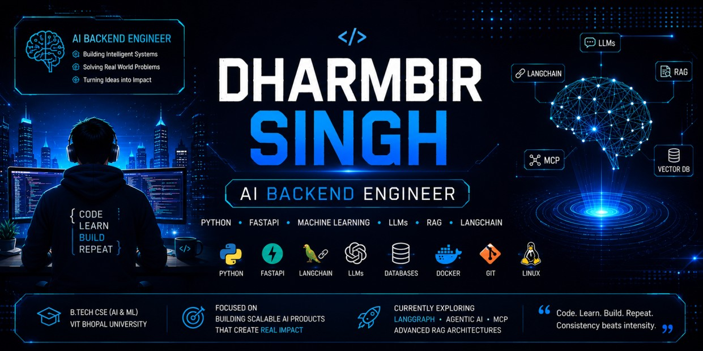

<!-- ========================================= -->
<!--             DHARMBIR SINGH                -->
<!-- ========================================= -->

  

<h1 align="center">Hi 👋, I'm Dharmbir Singh</h1>

<h3 align="center">
AI Backend Engineer • Machine Learning Engineer • GenAI Enthusiast
</h3>

---

# 💫 About Me

🎓 **B.Tech in Computer Science (AI & ML)**

💻 Passionate about building scalable AI applications and backend systems.

🤖 Experienced with:

- Python
- FastAPI
- Machine Learning
- NLP
- LLM Applications

🚀 Currently Learning

- LangChain
- LangGraph
- Agentic AI
- MCP
- Retrieval-Augmented Generation (RAG)

🌱 Currently building production-ready AI applications.

📫 **Reach Me**

- LinkedIn: https://linkedin.com/in/dhambirsingh

---

# 🛠 Tech Stack

---

# 🚀 Featured Projects

| 🚀 Project | Description |
|------------|-------------|
| 🤖 AI Resume Screener | ATS Resume Screening using NLP & Machine Learning |
| 🧠 Resume JD Matcher | Semantic Resume Matching using AI |
| 📊 Shopify Sales Analytics Dashboard | Interactive Business Intelligence Dashboard |
| 🩺 Multiple Disease Prediction | Healthcare Prediction using Machine Learning |
| 📄 Academic Peer Review Assistant | AI-powered Research Review Tool |
| 📚 Machine Learning Studio | Collection of Machine Learning Projects |

---

# 📊 GitHub Statistics

---

# 📈 Contribution Graph

---

# 🐍 Contribution Snake

💙 Turning Ideas into Intelligent AI Systems

</h3>

⭐ Thanks for visiting my profile!  
If you like my work, consider ⭐ starring my repositories and following me.

